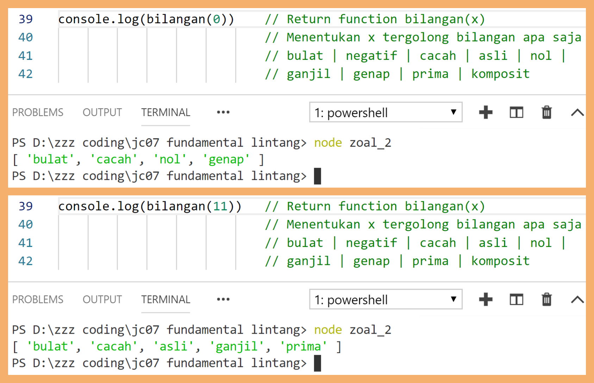
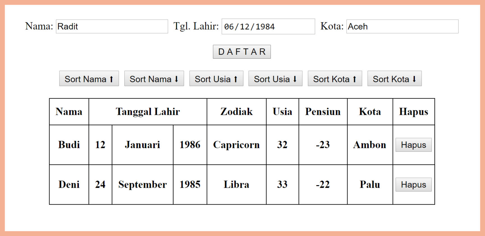

# Soal Ujian JavaScript Fundamental WMAD03


## **Soal 1 - Jam Dunia**

Buatlah tampilan sederhana jam dunia untuk 10 zona waktu, dengan memanfaatkan method `setInterval()` dan object `Date()`. Selisih antar zona waktu adalah 1 jam, 1 menit & 1 detik.


> _**Catatan:**_ _Commit dan push jawaban soal pertama ke akun Github Anda dengan nama repo: **Jam_Dunia**. Sertakan link url repo Github Anda. Kemudian kirimkan via email ke fredhopelane@gmail.com dengan subject email: **JS-Soal1-namaAnda**._

## **Soal 2 - Kategori Bilangan**

Buatlah sebuah __file JavaScript__ yang mengandung **sebuah return function (dengan 1 parameter)** untuk menentukan kategori bilangan sebuah angka. Misal: angka __13__ tergolong bilangan __*bulat*__, **_cacah_**, *__asli__*, **_ganjil_** & __*prima*__. Berikut adalah definisi & pengkategorian bilangan menurut laman Wikipedia [(klik di sini)](https://id.wikipedia.org/wiki/Bilangan):

- __Bilangan Bulat__: Bilangan yang terdiri atas bilangan cacah (0, 1, 2, 3, ...) beserta nilai negatifnya (0, -1, -2, -3, ...). Bilangan bulat dapat dituliskan tanpa komponen desimal atau pecahan.

- __Bilangan Cacah__: Himpunan bilangan bulat yang tidak bernilai negatif, yaitu (0, 1, 2, 3 ...).

- __Bilangan Negatif__: Himpunan bilangan bulat yang nilainya lebih kecil dari 0, yaitu (-1, -2, -3, ...)

- __Bilangan Nol__: Yaitu 0

- __Bilangan Asli__: Himpunan bilangan cacah positif yang bukan nol, yaitu (1, 2, 3, ...)

- __Bilangan Ganjil__: Himpunan bilangan asli positif yang nilainya tidak habis dibagi 2, yaitu (1, 3, 5, 7, 9, ...)

- __Bilangan Genap__: Himpunan bilangan asli positif yang nilainya habis dibagi 2, yaitu (2, 4, 6, 8, 10, ...). Bilangan nol (0) juga digolongkan sebagai bilangan genap.

- __Bilangan Prima__: Himpunan bilangan asli yang nilainya lebih besar daripada 1, yang faktor pembaginya adalah 1 dan bilangan itu sendiri. 2 dan 3 adalah bilangan prima. 4 bukan bilangan prima karena dapat dibagi 2.

- __Bilangan Komposit__: Himpunan bilangan asli yang nilainya lebih besar daripada 1, yang bukan merupakan bilangan prima.

  

Function yang dieksekusi:

  ```javascript
  console.log(bilangan(13))
  ```

Output yang diharapkan:

```bash
[ 'bulat', 'cacah', 'asli', 'ganjil', 'prima' ]
```

Contoh screenshot

  

> _**Catatan:**_ _Commit dan push jawaban soal kedua ke akun Github Anda dengan nama repo: **Kategori_Bilangan**. Sertakan link url repo Github Anda. Kemudian kirimkan via email ke fredhopelane@gmail.com dengan subject email: **JS-Soal2-namaAnda**._

## **Soal 3 - Data Tabel**

Buatlah sebuah **file HTML** yang mengandung **script JavaScript**, yang dapat memproses input dari user kemudian menampilkannya dalam bentuk tabel, mensortir data berdasarkan properti tertentu & menghapus data tertentu.

**_Requirements_**:

- User dapat mengisi data **nama**, **tanggal lahir** dan **kota**. Saat tombol **DAFTAR** ditekan, otomatis akan menampilkan data dari user tersebut dalam bentuk **tabel**.

- Data tabel yang ditampilkan memiliki kolom berikut:

  - **Nama**,
  - **Tanggal Lahir** (_terdiri atas 3 sub-kolom: **tanggal**, **bulan** & **tahun**_),
  - **Zodiak** (referensi Zodiak silakan Googling),
  - **Usia**,
  - **Pensiun** (berapa tahun lagi akan pensiun. Usia pensiun = 55 tahun),
  - **Kota**,
  - serta memiliki tombol **Hapus** untuk menghapus data.

- Disediakan pula **6 buah tombol** untuk mensortir data berdasarkan kolom **Nama**, **Usia** & **Kota**, baik secara **Ascending** maupun **Descending**.

- Contoh screenshot

    

> _**Catatan:**_ _Commit dan push jawaban soal ketiga ke akun Github Anda dengan nama repo: **Data_Tabel**. Sertakan link url repo Github Anda. Kemudian kirimkan via email ke fredhopelane@gmail.com dengan subject email: **JS-Soal3-namaAnda**._
