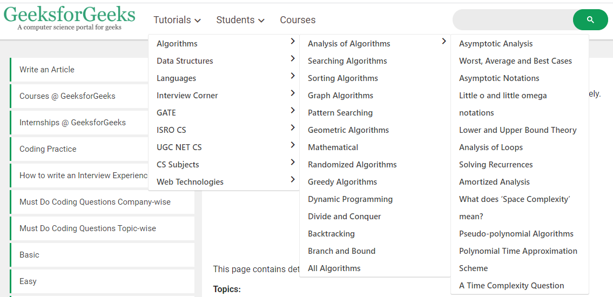

# Reference

## Main Reference

- [https://github.com/trekhleb/javascript-algorithms](https://github.com/trekhleb/javascript-algorithms)

Yang akan di bahas di kelas Purwadhika:

- Queue
- Stack
- Hash Table
- Tree
  - Binary Search Tree

## Real-Life Examples of Data Structures

In each of the following examples, please choose the best data structure(s). Options are: Array, Linked Lists, Stack, Queues, Trees, Graphs, Sets, Hash Tables. Note that there may not be one clear answer.

1. You have to store social network “feeds”. You do not know the size, and
things may need to be dynamically added.
2. You need to store undo/redo operations in a word processor.
3. You need to evaluate an expression (i.e., parse).
4. You need to store the friendship information on a social networking site.
I.e., who is friends with who.
5. You need to store an image (1000 by 1000 pixels) as a bitmap.
6. To implement printer spooler so that jobs can be printed in the order of
their arrival.
7. To implement back functionality in the internet browser.
8. To store the possible moves in a chess game.
9. To store a set of fixed key words which are referenced very frequently.
10. To store the customer order information in a drive-in burger place. (Customers keep on coming and they have to get their correct food at the
payment/food collection window.)
11. To store the genealogy information of biological species.
You won’t be able to answer all of these problems until you learn more
about data structures trees, graphs, etc. That’s what this course is about!

*Source: [https://www.cs.cornell.edu/courses/cs2110/2014sp/L09-Lists/data_structures.pdf](https://www.cs.cornell.edu/courses/cs2110/2014sp/L09-Lists/data_structures.pdf)*

## Another References

[https://www.geeksforgeeks.org/data-structures/](https://www.geeksforgeeks.org/data-structures/)
