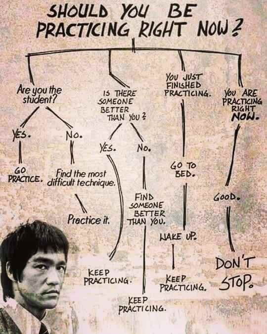

# Purwadhika Coding School

## Purwadhika 6 Bulan Part-Time Training

Anda akan belajar selama 6 bulan melalui sesi kelas bagaimana membangun aplikasi web front-end menggunakan ReactJS, aplikasi back-end menggunakan teknologi NodeJS, dan aplikasi Android menggunakan React Native.

## Self-Learning References

- freeCodeCamp.org [https://www.freecodecamp.org/](https://www.freecodecamp.org/)
- HTML [https://www.w3schools.com/html/default.asp](https://www.w3schools.com/html/default.asp)
- CSS [https://www.w3schools.com/css/default.asp](https://www.w3schools.com/css/default.asp)
- JavaScript [https://www.w3schools.com/js/default.asp](https://www.w3schools.com/js/default.asp)
- jQuery [https://www.w3schools.com/jquery/default.asp](https://www.w3schools.com/jquery/default.asp)
- CSS Bootstrap [https://www.w3schools.com/bootstrap/bootstrap_ver.asp](https://www.w3schools.com/bootstrap/bootstrap_ver.asp)
- React [https://www.w3schools.com/react/default.asp](https://www.w3schools.com/react/default.asp)

> Practice is the hardest part of learning, and training is the essence of transformation. *-Ann Voskamp*

> Every practice is a learning process. *-Kanniks Kannikeswaran*

> Knowing is not enough **we must apply**. Willing is not enough, **we must do**. *-Bruce Lee*

